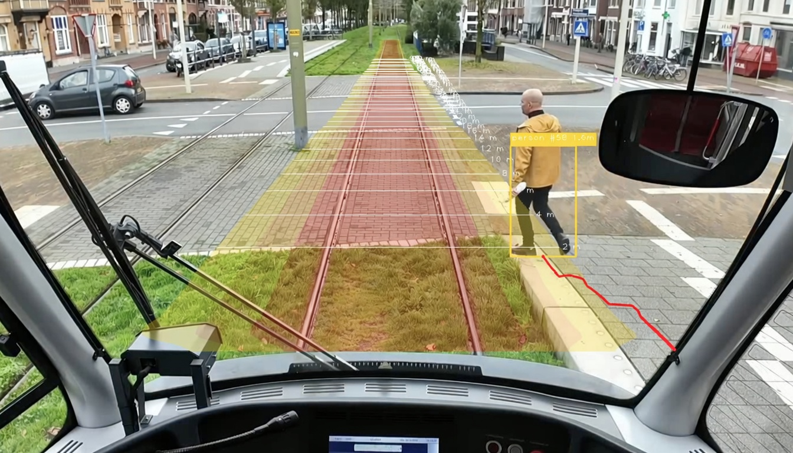
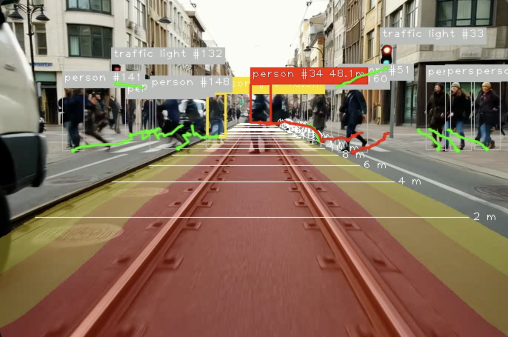
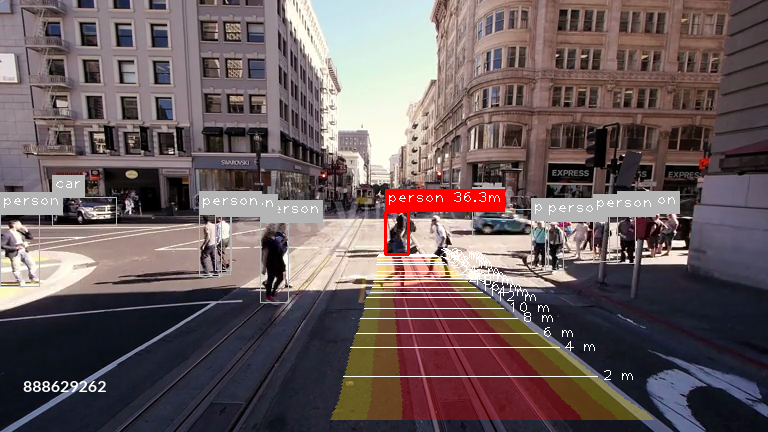
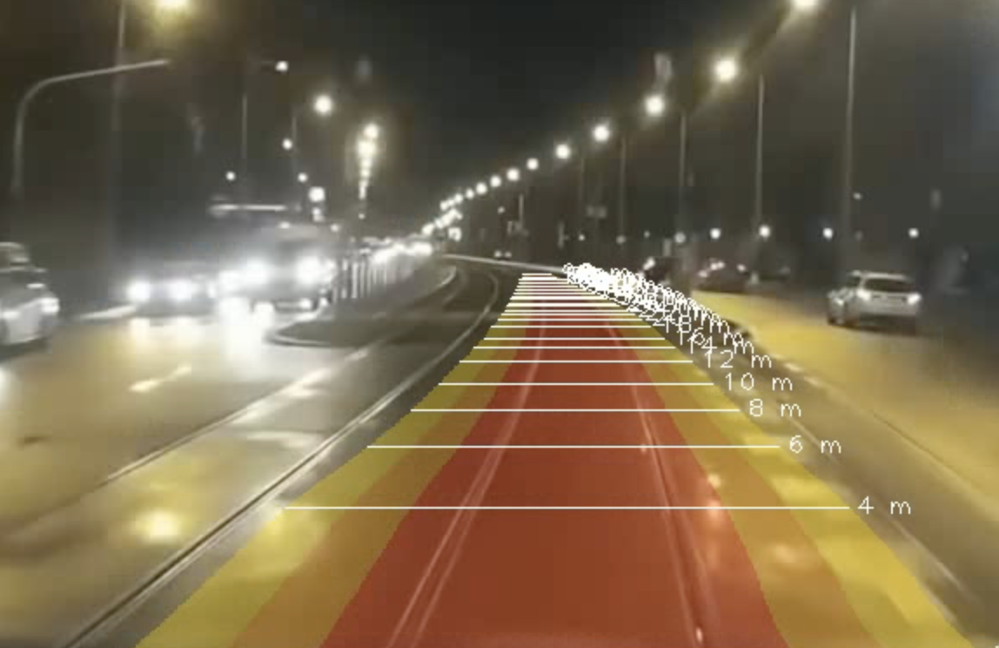

# Algorithm for detecting foreign objects on tram tracks (dRoI) based on segmentation

Weights available in HuggingFace: [here](https://huggingface.co/ayzeksalimli/tram-dynamic-roi-tracker-yolo11s).

--------------------

## Example:

    
    
    
    

--------------------

**Graduation Thesis (FQW/ВКР):** Algorithm for detecting foreign objects on tram tracks based on their segmentation.

Seven segmentation models were researched and trained (**YOLO-seg**: 8n, 8s, 11s, 26s; **SegFormer**: B0, B3; **DeepLabV3+**: ResNet50), as well as three detectors: YOLOX, YOLOv8, and YOLOv5.

Based on the research results, the following were selected for the task:
- **Segmentor**: **YOLOv11s-seg**
- **Detector**: **YOLOv8s**
- **Tracker**: **ByteTrack**

The developed algorithm is available at: [https://github.com/MathematicLove/tram-dynamic-roi-tracker](https://github.com/MathematicLove/tram-dynamic-roi-tracker/tree/main)

### Useful Links
- **Research paper (article)**: [https://elibrary.ru/qfcwed](https://elibrary.ru/qfcwed)
- **Diploma for 1st degree laureate** (Best report in ML and Intelligent Data Processing section): [Certificate](https://mathematiclove.github.io/my-cv/certificates/spbstu-science-week.jpg)
- **Full Thesis (FQW/ВКР)**: coming soon

---

## Available Models (Pickle)

| Model                  | Type           | Repository |
|------------------------|----------------|----------|
| YOLOv8n                | Segmentation   | [tram-dynamic-roi-tracker-yolo8n](https://huggingface.co/monadayzek/tram-dynamic-roi-tracker-yolo8n) |
| YOLOv8s                | Segmentation   | [tram-dynamic-roi-tracker-yolo8s](https://huggingface.co/monadayzek/tram-dynamic-roi-tracker-yolo8s) |
| YOLOv11s               | Segmentation   | [tram-dynamic-roi-tracker-yolo11s](https://huggingface.co/monadayzek/tram-dynamic-roi-tracker-yolo11s) |
| YOLOv26s               | Segmentation   | [tram-dynamic-roi-tracker-yolo26s](https://huggingface.co/monadayzek/tram-dynamic-roi-tracker-yolo26s) |
| SegFormer B0           | Segmentation   | [tram-dynamic-roi-tracker-segformerb0](https://huggingface.co/monadayzek/tram-dynamic-roi-tracker-segformerb0) |
| SegFormer B3           | Segmentation   | [tram-dynamic-roi-tracker-segformerb3](https://huggingface.co/monadayzek/tram-dynamic-roi-tracker-segformerb3) |
| DeepLabV3+ ResNet50    | Segmentation   | [tram-dynamic-roi-tracker-deeplabv3resnet50](https://huggingface.co/monadayzek/tram-dynamic-roi-tracker-deeplabv3resnet50) |

---

